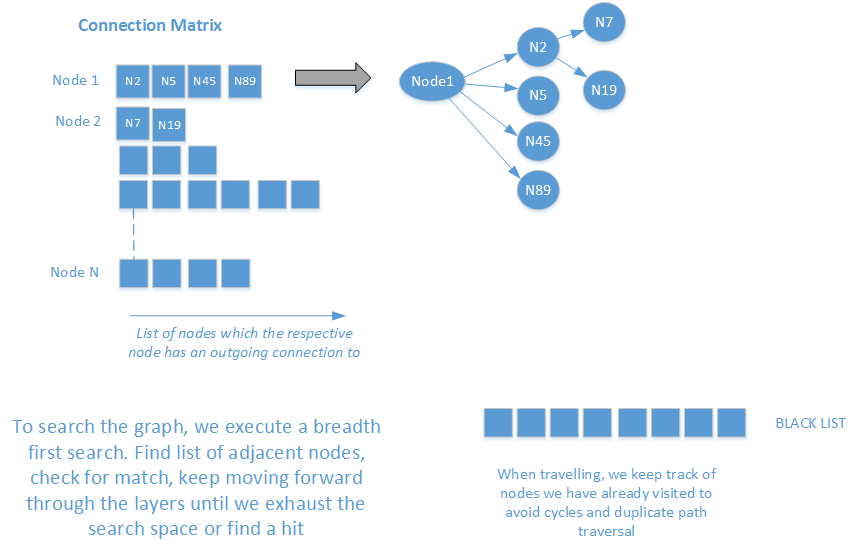

# graphSearch
Capture graph structure and find shortest path between two given nodes

Where multiple paths qualify for the shortest path (i.e. all the same length) then all such minimum paths are discovered. 
We can also query the graph to discover all paths emanating from a given node to distinct leaves. 
In this case, we discover ALL shortest paths for a given source to all nodes.

# Tools & Libraries
The code uses 

    * Mocha & should for unit testing 
    * Istanbul for code coverage checks 
    * Minimal use of the lodash library to simplify mundane tasks such as checking for empty values
    * Dracula Graph library purely for visuals on the browser
    * Bunyan for logging
    * nConf for handling configuration options
    * express for simple web server to facilitate basic ajax UI

Native nodejs profiler was used for performance optimization - biggest culprit being an early choice of an array for the blacklist instead of a map. 

# Usage
Code was developed against node 6. On downloading the code:

    * npm install - downloads and install necessary support libraries
    * npm run-script test - run unit tests
    * npm run-script cover - run code coverage checks [Note: generates [output](coverage/lcov-report/index.html "Coverage report") successfully but error shown at output at the end
    * node src/app.js - start web server and visit http://localhost:8081 for user interface
    